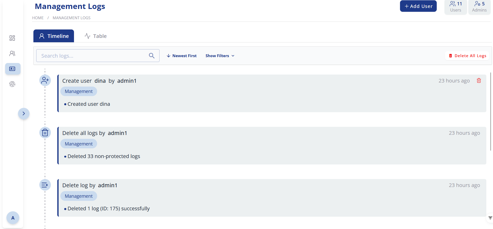
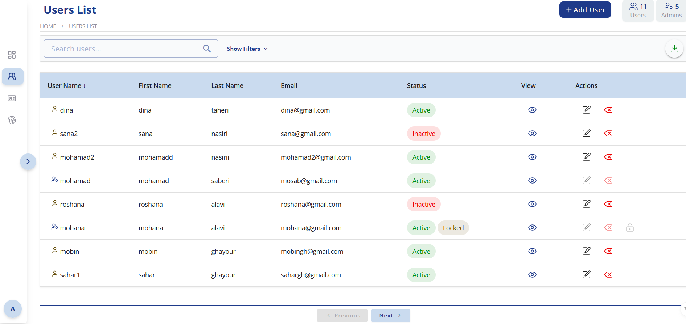

# User\_TimeLine

این پروژه یک **سامانه تحت وب برای مدیریت کاربران و مشاهده فعالیت‌های آن‌ها به صورت تایم‌لاین** است. کاربران می‌توانند فعالیت‌های خود را مشاهده کنند و مدیر سیستم می‌تواند کاربران و لاگ‌ها را مدیریت نماید. این پروژه با استفاده از **Django و GraphQL** پیاده‌سازی شده و از PostgreSQL به عنوان پایگاه داده پشتیبانی می‌کند.

---

## امکانات اصلی

### مدیریت کاربران

* افزودن، ویرایش و حذف کاربران عادی
* مشاهده مشخصات کاربران و فعالیت‌های آن‌ها در جدول
* امکان ورود و ثبت‌نام کاربران
* مدیریت نقش‌ها و دسترسی‌ها

### ثبت و مشاهده فعالیت‌ها

* ثبت لاگ تمامی فعالیت‌ها شامل زمان، نوع اقدام، و وضعیت (موفق/ناموفق)
* نمایش فعالیت‌ها در قالب تایم‌لاین (TimeLine) و جدول
* قابلیت فیلتر و جستجوی فعالیت‌ها

### امنیت و احراز هویت

* ورود امن با JWT
* امکان مدیریت دسترسی‌ها و سطوح کاربران

### گزارش و خروجی داده‌ها

* امکان دانلود کاربرانCSV
* مدیریت و مشاهده لاگ‌ها در UI به شکل سازمان‌یافته

---

## پیش‌نیازها و وابستگی‌ها

* **Python** نسخه ۳.۶ یا بالاتر
* **Node.js** (برای فرانت‌اند و فرآیندهای build)
* **pip** (نصب بسته‌های پایتون)
* **Django** (با دستور `pip install django`)
* سایر بسته‌های پایتون: با دستور `pip install -r requirements.txt` نصب می‌شوند
* پایگاه داده PostgreSQL
* GraphQL برای ارتباط فرانت‌اند و بک‌اند

---

## نصب و راه‌اندازی

1. کلون کردن مخزن:

```bash
git clone https://github.com/SaraRaoufii/User_TimeLine.git
cd User_TimeLine
```

2. ایجاد محیط مجازی (توصیه شده):

```bash
python3 -m venv venv
source venv/bin/activate  # لینوکس/مک
venv\Scripts\activate.bat # ویندوز
```

3. نصب وابستگی‌ها:

```bash
pip install -r requirements.txt
```

یا اگر فایل requirements.txt موجود نبود:

```bash
pip install django
```


4. رفتن به پوشه بک‌اند:

```bash
cd back-end
```

5. اعمال مهاجرت‌های پایگاه داده:

```bash
python manage.py migrate
```

6. ساخت کاربر ادمین:

```bash
python manage.py createsuperuser
```

7. راه‌اندازی سرور توسعه:

```bash
python manage.py runserver
```

8. دسترسی به برنامه:
   باز کردن مرورگر و رفتن به آدرس `http://127.0.0.1:8000/`

---

## استفاده و پنل ادمین

* دسترسی به پنل ادمین Django: `http://127.0.0.1:8000/admin/`
* مدیریت کاربران، لاگ‌ها و نقش‌ها از طریق پنل ادمین
* بررسی و فیلتر فعالیت‌های کاربران در تایم‌لاین
* APIها با استفاده از GraphQL در پوشه `back-end/Log/` پیاده‌سازی شده‌اند و می‌توان از آن‌ها برای ارتباط فرانت‌اند استفاده کرد

---

## تنظیمات و پیکربندی

* **پایگاه داده:** تنظیمات در `settings.py`
* **امنیت:** `SECRET_KEY` و `ALLOWED_HOSTS` در `settings.py`
* **محیط متغیرها:** ذخیره اطلاعات حساس (رمز پایگاه داده، JWT، API Keys) در فایل `.env` توصیه می‌شود
* **لاگ‌ها:** امکان تنظیم سطح و خروجی لاگ‌ها در `settings.py`

---





